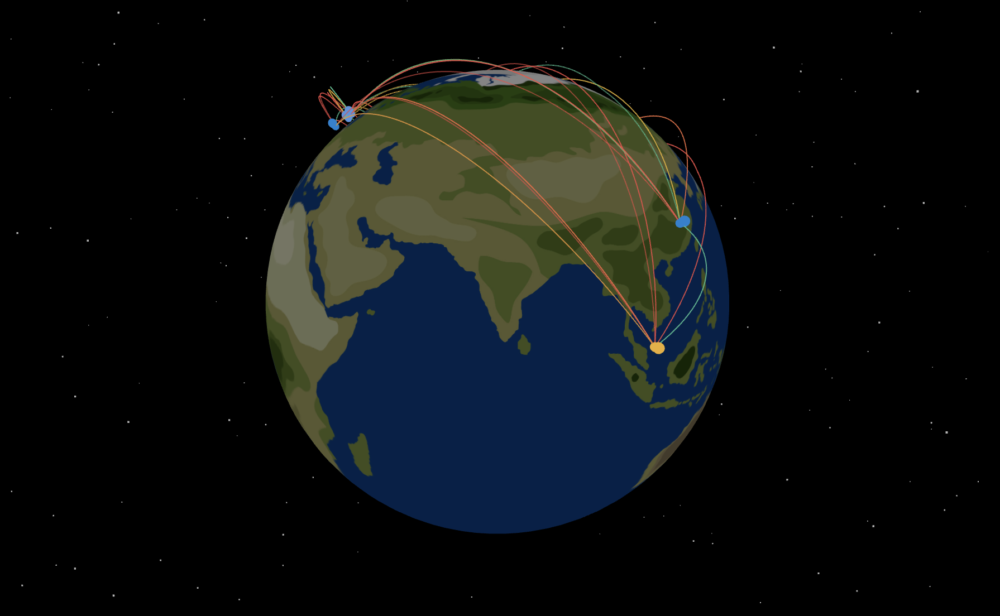

<div align="center">

# 🌍 Latency Topology Visualizer

*Visualize global crypto exchange latency in real-time 3D map*



[🚀 Demo](#-getting-started) • [📖 Docs](./TECHNICAL_ARCHITECTURE.md) • [🎯 Features](#-features) • [🛠️ Installation](#-installation)

</div>

---

## ✨ Overview

**Latency Topology Visualizer** is a cutting-edge 3D web application that transforms complex network data into beautiful, interactive visualizations. Monitor cryptocurrency exchange performance across the globe in real-time with stunning 3D graphics and intuitive controls.

> **🎯 Perfect for**: Network engineers, crypto traders, system administrators, and anyone interested in global network performance visualization.

## 🌟 Features

### 🌐 **Interactive 3D Globe**
- **Real-time Visualization**: Watch network connections pulse across a beautiful 3D Earth
- **Smooth Interactions**: Pan, zoom, and rotate with buttery-smooth 60fps animations
- **Dynamic Connections**: Animated lines showing latency data between exchanges
- **WebGL Powered**: Hardware-accelerated graphics for optimal performance

### 📊 **Performance Metrics Dashboard**
- **Live Monitoring**: Real-time system health and connection status
- **Statistical Analysis**: Average latency, connection counts, and system health indicators
- **Color-coded Status**: Instant visual feedback with green/yellow/red indicators
- **Responsive Layout**: Beautiful glass-morphism design that adapts to any screen

### 📈 **Historical Analytics**
- **Time-series Charts**: Interactive charts powered by Recharts
- **Customizable Ranges**: 1 hour, 24 hours, 7 days, or 30 days of data
- **Trend Analysis**: Identify patterns and performance trends over time
- **Export Capabilities**: Download data and visualizations for reports

### 🎛️ **Advanced Control Panel**
- **Smart Filtering**: Filter by exchanges, cloud providers, or latency ranges
- **Search Functionality**: Quickly find specific exchanges or regions
- **Modal Interface**: Clean, accessible modal design with keyboard navigation
- **Export Tools**: Excel/CSV export with customizable data sets

### 📱 **Responsive & Accessible**
- **Mobile-first Design**: Optimized for phones, tablets, and desktops
- **WCAG Compliance**: Full accessibility with screen reader support
- **Keyboard Navigation**: Complete keyboard control for all features
- **Custom Cursor**: Animated cursor that adapts to interface elements

### 🎨 **Modern UI/UX**
- **Glass Morphism**: Beautiful translucent panels with backdrop blur
- **Smooth Animations**: Framer Motion powers all transitions and interactions
- **Dark Theme**: Sleek black design optimized for extended viewing
- **Micro-interactions**: Delightful hover effects and feedback

## 🛠️ Technology Stack

### Core Framework
- **[Next.js 15.4.3](https://nextjs.org/)** - React framework with App Router
- **[React 19.1.0](https://reactjs.org/)** - UI library
- **[TypeScript 5.x](https://www.typescriptlang.org/)** - Type-safe JavaScript

### 3D Visualization
- **[Three.js 0.178.0](https://threejs.org/)** - 3D graphics library
- **[@react-three/fiber 9.2.0](https://docs.pmnd.rs/react-three-fiber)** - React renderer for Three.js
- **[@react-three/drei 10.6.0](https://github.com/pmndrs/drei)** - Three.js utilities and helpers

### UI & Styling
- **[Tailwind CSS 4.x](https://tailwindcss.com/)** - Utility-first CSS framework
- **[Framer Motion 12.23.7](https://www.framer.com/motion/)** - Animation library
- **[Lucide React 0.525.0](https://lucide.dev/)** - Icon library
- **[clsx 2.1.1](https://github.com/lukeed/clsx)** & **[tailwind-merge 3.3.1](https://github.com/dcastil/tailwind-merge)** - Conditional styling utilities

### Data Visualization
- **[Recharts 3.1.0](https://recharts.org/)** - Chart library for React
- **[date-fns 4.1.0](https://date-fns.org/)** - Date utility library

### Development Tools
- **[ESLint](https://eslint.org/)** - Code linting
- **[Turbopack](https://turbo.build/pack)** - Fast bundler for development

## 🚀 Getting Started

### Prerequisites

- Node.js 18.x or higher
- npm, yarn, pnpm, or bun package manager

### Installation

1. **Clone the repository**
   ```bash
   git clone https://github.com/MrDanielD326/Latency-Topology-Visualizer
   cd latency-topology-visualizer
   ```

2. **Install dependencies**
   ```bash
   npm install
   ```

3. **Start the development server**
   ```bash
   npm run dev
   ```

4. **Open your browser**
   Navigate to [http://localhost:3000](http://localhost:3000) to see the application.

### Available Scripts

| Command | Description |
|---------|-------------|
| `npm run dev` | 🚀 Start development server with Turbopack |
| `npm run build` | 📦 Build production application |
| `npm run start` | ▶️ Start production server |
| `npm run lint` | 🔍 Run ESLint code analysis |
| `npm run collect-data` | 📊 Execute TypeScript data collection |
| `npm run collect-data-verbose` | 📊 Run data collection with verbose output |
| `npm run monitor-network` | 📡 Start continuous network monitoring |
| `npm run collect-ts` | 🔧 Run TypeScript data collector directly |

## 📁 Project Structure

```
src/
├── app/                    # Next.js App Router
│   ├── globals.css        # Global styles and responsive design
│   ├── layout.tsx         # Root layout with custom cursor
│   └── page.tsx           # Main application page
├── components/            # React components
│   ├── ControlPanel.tsx   # Filter and settings panel
│   ├── CustomCursor.tsx   # Custom animated cursor
│   ├── Globe3D.tsx        # 3D globe visualization
│   ├── Header.tsx         # Application header
│   ├── Footer.tsx         # Application footer
│   ├── LatencyChart.tsx   # Historical data charts
│   ├── Modal.tsx          # Accessible modal component
│   ├── ModalPortal.tsx    # Modal portal wrapper
│   └── PerformanceMetrics.tsx # System metrics display
├── data/                  # Data management
│   ├── mockData.ts        # Mock exchange and region data
│   ├── networkMeasurement.ts # Network measurement utilities
│   └── realWorldData.ts   # Real-world data integration
├── hooks/                 # Custom React hooks
│   └── useCursor.ts       # Cursor management hook
├── lib/                   # Utility functions
│   └── utils.ts           # Common utilities and helpers
├── scripts/               # Data collection scripts
│   └── dataCollector.ts   # Network data collection
└── types/                 # TypeScript type definitions
    └── index.ts           # Application types
```

## 🎯 Key Assumptions

### Data Sources
- **Mock Data**: Currently uses simulated latency data for demonstration purposes
- **Exchange Locations**: Based on publicly available exchange server locations
- **Cloud Regions**: Includes major AWS, GCP, and Azure regions
- **Latency Range**: Simulated latencies between 10-210ms for realistic representation

### Network Topology
- **Exchange-to-Exchange**: Direct connections between all exchange pairs
- **Exchange-to-Region**: Selective connections (70% probability) to cloud regions
- **Update Frequency**: Real-time data updates every 10 seconds
- **Historical Data**: 100 data points per time range for chart visualization

### Browser Support
- **Modern Browsers**: Chrome 88+, Firefox 85+, Safari 14+, Edge 88+
- **WebGL Support**: Required for 3D globe functionality
- **Responsive Design**: Mobile-first approach supporting viewport widths from 320px

### Performance Considerations
- **3D Rendering**: Optimized for 60fps on desktop, 30fps on mobile
- **Data Volume**: Designed to handle 50+ exchange connections simultaneously
- **Memory Usage**: Efficient Three.js scene management with automatic cleanup

## 🎨 Design System

### Color Scheme
- **Primary Background**: `#000000` (Pure black)
- **Glass Panels**: `rgba(17, 24, 39, 0.6)` with backdrop blur
- **Accent Colors**: White (`#ffffff`) for primary text
- **Status Indicators**: Green (good), Yellow (warning), Red (critical)

### Typography
- **Primary Font**: Geist Sans (Vercel's font family)
- **Fallback**: Arial, Helvetica, sans-serif
- **Responsive Scaling**: Fluid typography across breakpoints

### Layout Breakpoints
- **Mobile**: `< 768px` (Vertical stack layout)
- **Tablet**: `768px - 1023px` (Adaptive layout)
- **Desktop**: `1024px - 1279px` (Horizontal split)
- **Large Desktop**: `≥ 1280px` (Optimized spacing)

## 🔧 Configuration

### Environment Variables
No environment variables are currently required for basic functionality.

### TypeScript Configuration
- **Target**: ES2017 for broad browser compatibility
- **Strict Mode**: Enabled for type safety
- **Path Mapping**: `@/*` for clean imports from `src/`

### Next.js Configuration
- **App Router**: Enabled for modern routing
- **Turbopack**: Enabled for faster development builds
- **Font Optimization**: Automatic optimization for Geist fonts

## 📱 Responsive Design

The application adapts to different screen sizes:

- **Desktop**: Side-by-side layout with performance metrics (380-480px) and globe visualization
- **Mobile**: Vertical stack with 40% height for metrics, 60% for globe
- **Filters**: Modal-based approach accessible via floating button
- **Custom Cursor**: Adapts appearance when hovering over modal elements

## ♿ Accessibility Features

- **ARIA Labels**: Comprehensive labeling for screen readers
- **Keyboard Navigation**: Full keyboard support with focus management
- **Focus Trapping**: Modal dialogs trap focus appropriately
- **Color Contrast**: WCAG AA compliant color ratios
- **Custom Cursor**: Maintains accessibility while hiding default cursor

## 📊 Data Structure

### Exchange Schema
```typescript
interface Exchange {
  id: string
  name: string
  location: { lat: number; lng: number; city: string; country: string }
  cloudProvider: 'AWS' | 'GCP' | 'Azure'
  region: string
  serverCount: number
}
```

### Latency Data Schema  
```typescript
interface LatencyData {
  id: string
  fromId: string
  toId: string
  latency: number
  timestamp: number
  type: 'exchange-to-exchange' | 'exchange-to-region' | 'region-to-region'
}
```

## 🚧 Known Limitations

- **Mock Data**: Uses simulated data instead of real network measurements
- **WebGL Dependency**: Requires hardware acceleration for optimal 3D performance
- **Browser Support**: Limited support for older browsers without WebGL
- **Real-time Data**: Currently simulated; integration with actual APIs needed for production

## 🔮 Future Enhancements

- Integration with real exchange APIs
- Historical data persistence
- Advanced filtering and search capabilities
- Export functionality for data and visualizations
- Multi-language support
- Dark/light theme toggle

## 📊 Data Collection

### Quick Start Data Collection

```bash
# Collect data from all sources
npm run collect-data

# Monitor network in real-time
npm run monitor-network

# View collected data
ls src/data/collected/
```

### What Gets Collected
- **🏦 Cryptocurrency Exchanges**: Latency to 25+ major exchanges worldwide
- **☁️ Cloud Providers**: Response times from AWS, GCP, and Azure regions
- **🌐 Internet Infrastructure**: CDN and DNS provider performance
- **📡 Network Topology**: Local network configuration and routing

## 📄 Documentation

| Document | Description |
|----------|-------------|
| [`TECHNICAL_SUMMARY.md`](./TECHNICAL_SUMMARY.md) | 📋 Technical implementation summary and overview |
| [`DATA_COLLECTION.md`](./DATA_COLLECTION.md) | 📡 Network data collection methodology and usage |
| [`CHANGELOG.md`](./CHANGELOG.md) | 📋 Project changes and version history |

---